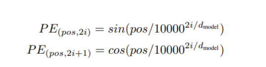
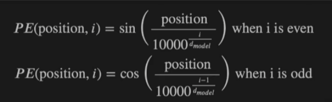
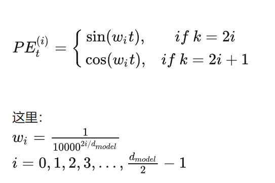
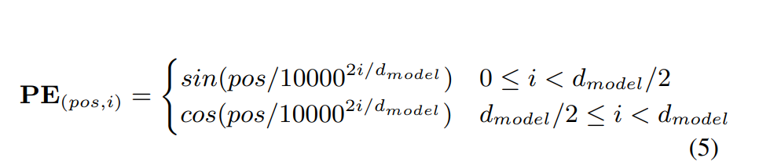
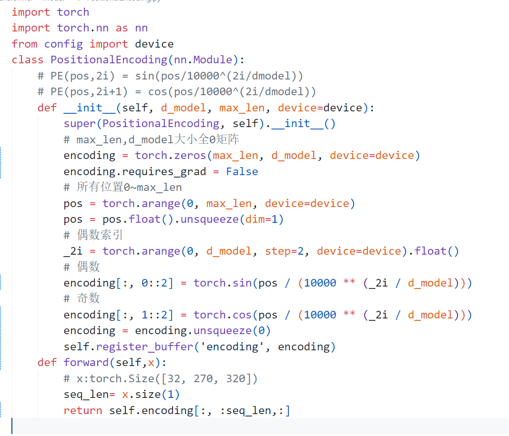
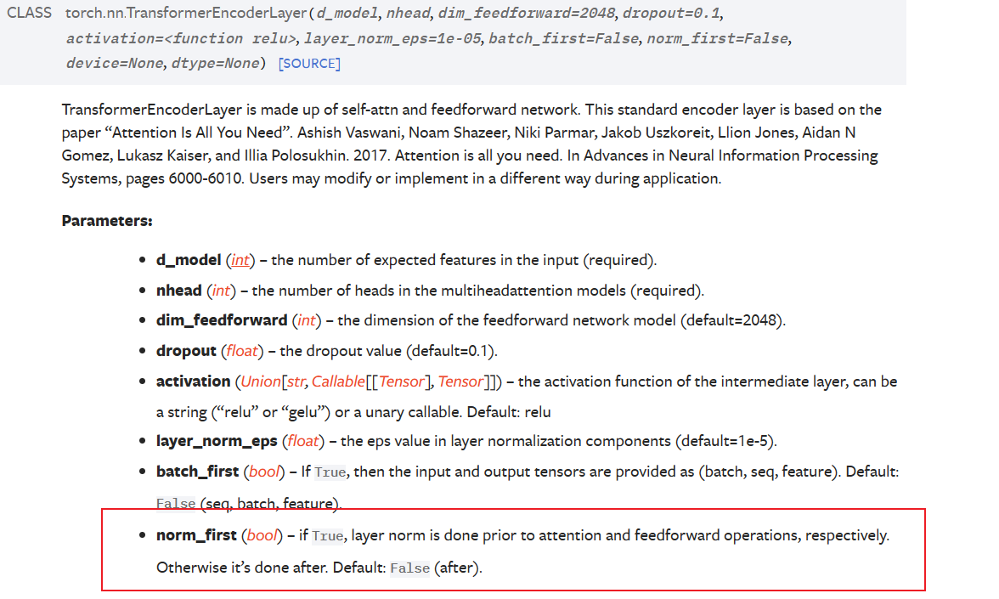

1.数据预处理:

获取数据集,数据集为:

VOCAB:字符是键,整数索引是值

IVOCAB:整数索引是键,字符是值

train:列表,每个值是一个字典,字典内容为:trn(键) 训练文本的编码形式(值)   wave(键)训练文本对应的音频文件路径(值)   

dev:交叉验证  ?

test:测试集

bigram_freq:频率表,二维,大小是vocab_size*vocab_size,每一个位置表示这个二元组出现在所有文本的频率

noise_and_feature的extract_feature不懂,padding不懂

"sr"代表采样率（sample rate）。采样率是指在一秒钟内对声音信号进行采样的次数。它表示每秒从连续模拟信号中获取的离散样本数。

在继承 `torch.utils.data.Dataset` 时，通常将数据预处理步骤放在 `__getitem__` 方法中进行处理是更好的选择。

主要原因如下：

1. **节省内存**: 如果在 `__init__` 中将所有特征处理好，可能会占用大量内存空间，尤其是当数据集很大时。而在 `__getitem__` 中，可以按需处理每个样本，避免一次性加载和处理全部数据，从而节省内存。
2. **灵活性**: 将数据预处理步骤放在 `__getitem__` 中可以提供更大的灵活性。例如，可以根据实际需求对每个样本应用不同的预处理操作，或者根据当前的数据加载需求动态地选择是否应用某些预处理操作。
3. **可复用性**: 将数据预处理步骤放在 `__getitem__` 中可以更方便地复用代码。可以使用相同的数据集类在不同的上下文中使用不同的预处理逻辑，而无需修改类的定义。

综上所述，将数据预处理步骤放在 `__getitem__` 方法中处理是更好的选择，因为它具有内存效率、灵活性和可复用性的优势。

通过使用检查点，代码可以从特定的epoch继续训练，避免从头开始训练。这在训练时间较长的情况下非常有用，可以保存模型状态，以防训练中断或定期进行模型评估时重新开始训练。

使用`.tar`文件的优点是可以同时保存多个对象，例如模型、优化器以及其他训练相关的信息。通过将这些对象打包在一个`.tar`文件中，可以方便地一次性保存和加载它们，避免了在训练过程中创建多个独立的检查点文件。

填充整个数据集和填充每个批次区别?

There are many choices of positional encodings, learned and fixed [9].位置编码原文说有好多种

编码公式transformer原文:

另外两种写法

无法与原文对应

注意!

encoder问题:原文得到编码后进入encoder先layer norm,transformer论文进去先多头

未看清图导致残差错误

pytorch在jupyter加载了数据之后函数加载一次修改无效,必须停止,比较麻烦

单词编码:前一时刻与后一时刻的错位:前一时刻使用前导0补充,前一时刻所有之前补的-1都变成1